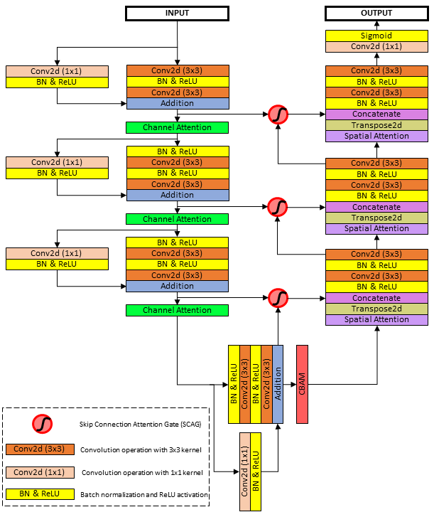

# Liver-Tumor-Segmentation

### Abstract

Automatic liver tumor segmentation is a paramount important application for liver tumor diagnosis and treatment planning. However, it has become a highly challenging task due to the heterogeneity of the tumor shape and intensity variation. Automatic liver tumor segmentation is capable to establish the diagnostic standard to provide relevant radiological information to all levels of expertise. Recently, deep convolutional neural networks have demonstrated superiority in feature extraction and learning in medical image segmentation. However, multi-layer dense feature stacks make the model quite inconsistent in imitating visual attention and awareness of radiological expertise for tumor recognition and segmentation task. To bridge that visual attention capability, attention mechanisms have developed for better feature selection. In this paper, we propose a novel network named Multi Attention Network (MANet) as a fusion of attention mechanisms to learn highlighting important features while suppressing irrelevant features for the tumor segmentation task. The proposed deep learning network has followed U-Net as the basic architecture. Moreover, residual mechanism is implemented in the encoder. Convolutional block attention module has split into channel attention and spatial attention modules to implement in encoder and decoder of the proposed architecture. The attention mechanism in Attention U-Net is integrated to extract low-level features to combine with high-level ones. The developed deep learning architecture is trained and evaluated on the publicly available MICCAI 2017 Liver Tumor Segmentation dataset and 3DIRCADb dataset under various evaluation metrics. MANet demonstrated promising results compared to state-of-the-art methods with comparatively small parameter overhead. 
 
 

[Publication](https://www.nature.com/articles/s41598-023-46580-4) l [Thesis](https://kasunhettihewa.github.io/Liver-Tumor-Segmentation_MANet/assets/docs/Thesis.pdf)
 
 

